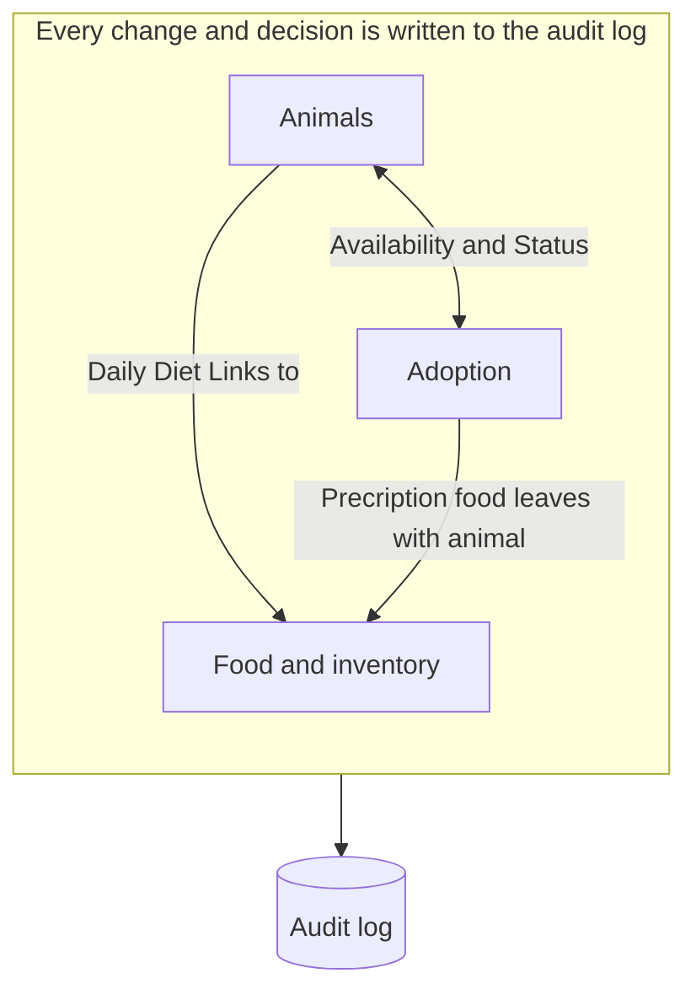
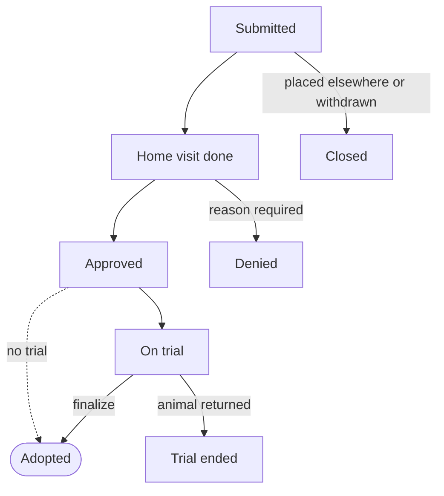

# Software Requirements Specifications

> References:
>
> \[Software Requirements Specifications, Building a Blueprint for Success: Navigating the Complexities of Software Requirements: Link - [https://www.computer.org/resources/software-requirements-specifications#requirements-fundamentals](<https://www.computer.org/resources/software-requirements-specifications#requirements-fundamentals>) \]
>
> \[Pankaj Jalote: A Concise Introduction to Software Engineering: Section 3.3.3: Structure of a Requirements Document\]
>
> \[Initial Interview with Director of Ruby Hill Rescue (Mike), September 1, 2026\]
>
> \[Second Interview with Director of Ruby Hill Rescue (Mike), September 8, 2026\]
>
> \["Master Copy Final Two", The Director's Current Spreadsheet, posted to the Class GitHub Repository\]

SRS Version 1.0: Initial Version

Maintained by: Levi Salcido

+++ # Introduction and Purpose

The following is a definition for an internal system designed for a desktop to replace Ruby Hill Rescue's shared spreadsheet, intake records, adoption decisions tracking, and inventory tracking movement. The end result is an efficient yet simple system that lets staff retrieve past information and keeps a sustainable record of everything the rescue does. The system is referred to as the Ruby Hill Rescue Management System (RHRMS).

## Section 1.1

This SRS is an agreement between Ruby Hill Director, Mike, and the development team, and a document to consolidate ideas across the development team. The goal is to define at a high level the basis for design, testing and acceptance to mitigate design flaws early on and maintain consistency throughout the development process.

This project was initiated due to the main failure of a lack of retroactive outlook on decisions made by the Ruby Hill Team. It was reported that last year a rejected applicant's Facebook post drew a decent view count and made claims the rescue could not refute. Not because the claims were true, but because there was not a reliable source to definitively draw a conclusion weather the applicant's experience was valid or not.

The director's main requirement is that this case is covered:

> Every adoption decision, especially a denial, can be reconstructed later on and referenced.

+++

+++ ## Section 1.2: Scope

RHRMS, is a staff operated designed for an internal office desktop for the front desk (reception). It will handle:

* Animal Intake Records
    * Returns of previously adopted animals, linked to the animal's earlier record
* Animal status and changes
* Adoption applications
    * The full workflow and tracking, from application → home visit → decision → optional trial → completed adoption
* Food stock tracking
    * Regular and prescription food
    * Direct links between each animal and the food it eats
    * Warnings early enough to reorder before stock runs out
* Lookup of past application decisions (denials and approvals), with the reasons behind them
* An audit log of every change, so no record is silently overwritten

+++

+++ ## Section 1.3: Definitions, Acronyms and Abbreviations

| Term | Meaning |
| -- | -- |
| Animal ID | Permanent, system-assigned identifier for an animal. Never reused and never changed when the animal is renamed. |
| Stay | One continuous period an animal is in the rescue's care, from intake to adoption. A returned animal starts a new stay on the same Animal ID. |
| Intake source | One of four values: owner surrender, found stray, city shelter overflow, born in care. |
| Application | One person's request to adopt one specific animal. A person may hold several open applications at once. |
| Home visit | A volunteer's in-person check of the applicant's home, with recorded findings. |
| Decision | Approval or denial of an application, with a required reason category, explanation, decider and date. |
| Trial adoption | An optional period of about one week in which an approved applicant takes the animal home before the adoption is final. |
| Prescription food | Food prescribed for specific animals, with a reorder lead time of about 10 days. |
| Days of supply | Food on hand divided by forecast daily use for the animals currently eating it. |
| Audit log | Append-only record of every create, change and decision: who, when, old value, new value and reason. |
| Must / Should / Could | Requirement priority. Must = required for acceptance; Should = included if time allows; Could = future. |
| RHRMS | Ruby Hill Rescue Management System. |
| SRS | Software Requirements Specification. |

+++

# Overall Product Description

+++ ## Section 2.1: Product Perspective

RHRMS is overall a new system. It replaces the shared Google Sheet ("Master Copy Final Two"), that had about 4 people edit and often overwrite other peoples works and contributing to misconstruing information on the spreadsheet. The shared Gmail account and the Facebook page stay separate (For Now). This system is currently in early phases and the IVP will only need to hold records that can be looked up to verify what happened.

The customer-facing process does not change. Adopters will continue to walk in, look in the kennels and fill out an application on paper. We were given a copy of that application so the system can properly receive it. Staff will need add in a new step to the workflow and type the data in at the single font-desk computer.

A critical case here is the need for simplicity. The director left the previous rescue partly because of excessive process so the system needs to ensure a simple process. However, if more features need to be added later, the system should be able to handle new features to be added or removed later.

RHRMS is not a complicated system, instead it spans across a wide direction of cases that needs to be handled and tracked. 3 critical junctions have been identified. Animals, Adoption, and Food && inventory.

* **Animal status controls adoption.** Only an available animal can receive an application or a decision. Finalizing an adoption closes every other open application for that animal.
* **Animal status drives the food forecast.** Each animal's diet sets its daily food use. An intake adds to the forecast; an adoption removes it, and any prescription food leaves with the animal.
* **Every change lands in one audit log.** Intakes, corrections, decisions and stock movements all record who, when, old and new values, and the reason.

+++

+++ ## Section 2.2: Product Functions

7 different kinds of records and attributes have been found that need to be stored as records in the system for thorough tracking. Without one of these, gaps in reports will be created. Example, if the Person is not recorded with Home Visit and Decision, the main intent is not fulfilled with tracking the why the Application was denied for the Animal in the certain Kennel; Staff User then cannot view that data. A simple example uses most of the listed attributes. Food and Product stock is an implied attribute because it connects to most of the others inherently.

|  | Data Record Types | Definition | Discovered in |
| -- | -- | -- | -- |
| 1 | Animal | Animal ID, current name and name history, species, breed (if known), approximate age, health condition, spay/neuter status, status, stays | Interview 1, Interview 2 |
| 2 | Kennel | Kennel number, current occupant(s); one animal per kennel except a litter with its mother or a bonded pair | Interview 1, Interview 2 |
| 3 | Person | Applicant or adopter contact details and history across all applications, so returning adopters are recognized | Interview 1 |
| 4 | Application | One person applying for one animal: date, answers from the paper form (home type, yard, children, pet policy, reason for adopting), status | Interview 1, Interview 2 |
| 5 | Home visit and decision | Visiting volunteer, date, findings, outcome, reason category and explanation, decider, re-eligibility | Interview 1, Interview 2 |
| 6 | Food product and stock | Product, regular or prescription, bag size, reorder lead time, bags on hand by location (shelter, garage overflow), which animals eat it | Interview 1, Interview 2 |
| 7 | Staff user | Name, role, individual login; every action is attributed to one user | Interview 2 |

A **record type** is a kind of thing the system stores data about. It is different from an **actor**, who is someone using the system. Person and Staff User are both records because the system has to remember people. Only staff are actors; adopters never use the software themselves.

The system supports two workflows and one continuous process:

1. **Intake:** an animal arrives from one of four sources, is recorded, housed in a kennel, given a diet and listed as available. A returned animal re-enters on its existing record.
2. **Adoption:** application → home visit → decision → optional one-week trial → final adoption. Staff judgment, not the order of applications, picks between competing applicants.
3. **Food (continuous):** stock is received and opened by the bag. The system forecasts daily use from the animals currently in care and warns before any product, especially a prescription one, runs out.

**Use case summary** — (Full explanations in 3.2)

| ID | Use case | Primary actor | Priority |
| -- | -- | -- | -- |
| UC-01 | Record an animal intake | Front-desk volunteer | Must |
| UC-02 | Find an animal and see where it is | Any staff member | Must |
| UC-03 | Correct or update an animal record | Staff member | Must |
| UC-04 | Record an adoption application | Front-desk volunteer | Must |
| UC-05 | Record a home visit | Home-visit volunteer | Must |
| UC-06 | Decide an application | Home-visit volunteer or director | Must |
| UC-07 | Finalize an adoption (with optional trial) | Staff member | Must |
| UC-08 | Record a food stock movement | Staff member | Must |
| UC-09 | Review food warnings | Director or staff member | Must |
| UC-10 | Look up why a decision was made | Director | Must |

+++

+++ ## Section 2.3: User Characteristics

All users are rescue staff or volunteers working at one front-desk computer. Adopters never use the system directly.

| User class | Who | Count | Technical skill | Main tasks |  |
| -- | -- | -- | -- | -- | -- |
| Director | Mike | 1 | Preferably Low; can work through the spreadsheet but prefers others handle it. Main Operator of Business however. | Look up past decisions, manage and review food inventory, manage accounts, override decisions |  |
| Coordinator | Diane (Primary Coordinator) | 1 | Moderate-High; knows the current records in detail.  | Corrections, stock review |  |
| Paid staff | Part-time employees | 2 | Moderate; Managed and directed by Diane | Intake, applications, food receiving, adoptions |  |
| Regular volunteers | Front desk and home visits | About 8 of 25 | Mixed; volunteers come and go without notice | Intake, home visits and decisions |  |

The driving factors for these are high turnover and some volunteers leave without notice. The system should not depend on one person remembering what happened. Secondly, the director is the least technical user, however still needs full capability to review old records. The system should work at a intuitive system or a self-documenting system level especially on record lookup interfaces.

+++

+++ ## Section 2.4: General Constraints

* **GC-1 Technology stack.** Java, PostgreSQL and GitHub.
* **GC-2 Hardware.** One shared front-desk computer. The system must run locally on it with no server or internet connection.
* **GC-3 Simplicity.** Each workflow may require no more steps than the rescue performs currently. Features must be removable without breaking others.
* **GC-4 No paper records.** After deployment, nothing is kept on paper except the signed application form the adopter fills in. The system does not restrict the use of paper records, rather works as a parallel. The main idea is the system does not rely on the existence and proof of a paper record.

+++

## Section 2.5: Assumptions and Dependencies

TDB (Pending Additional Information)

# Detailed Requirements

+++ ## Section 3.1: External Interface Requirements

### Section 3.1.1: User Interfaces

#### 3.1.1 User Interfaces

TDB (Pending Additional Information)

#### 3.1.2 Hardware Interfaces

*  Runs on the single front-desk computer No special hardware. (Must)

#### 3.1.3 Software Interfaces

* Uses a PostgreSQL database installed locally on the front-desk computer, connected over JDBC. (Must)
    * JDBC **is** the standard way a Java application creates a direct connection to PostgreSQL. It is not an alternative to a direct connection; it is the official layer that makes it possible.
* Exports a search result or a decision record to CSV or PDF. (Should)

#### 3.1.4 Communication Interfaces

None in Version 1.0. The system does not send email, post to social media or publish an online listing. An online listing may be a later extension; adopters would still visit in person.

+++

+++ ## Section 3.2: Functional Requirements

### 3.2.1 Animals

#### Record an animal intake

**Actor:** front-desk volunteer or staff member **Goal:** a newly arrived animal is recorded, housed and listed as available.

**Main flow**

1. The volunteer opens Intake and chooses New animal.
2. The volunteer enters species, breed (if known), approximate age, intake source, health notes, spay/neuter status and name (if any).
3. The system checks capacity and shows any possible matching records (same species arriving the same day, or a similar past animal).
4. The volunteer picks an empty kennel and a diet (food product and cups per meal).
5. The system assigns a permanent Animal ID, starts a new stay, sets the status to Available and adds the animal's daily food use to the forecast.
6. The system shows the new record with its Animal ID and kennel number.

---

#### Find an animal and see where it is

**Actor:** any staff member **Goal:** pull up an animal and see who it is and where it is

**Main flow**

1. The user types a current or former name, Animal ID, kennel number, species or breed.
2. The system lists matches, each showing name, former names, Animal ID, species, kennel and status.
3. The user opens one and sees its status, location (kennel, on trial with whom, or adopted by whom), diet, applications and history.

---

#### Correct or update an animal record

**Actor:** staff member **Goal:** fix a mistake or record a change (rename, health update, kennel move, diet change) without losing what was there before.

**Main flow**

1. The user opens the animal and chooses Edit.
2. The user changes one or more fields and enters a short reason.
3. The system saves the new values and logs the old values, new values, user, time and reason.

---

### 3.2.2 Adoption

An application may only move through the states below. Each transition is logged with the user and the reason.

Other applications for an animal stay open while one applicant is approved or on trial, because a failed trial puts the animal back up for adoption. They close only when the adoption is final.

---

#### Record an adoption application

**Actor:** front-desk volunteer; the adopter provides the information on the paper form **Goal:** the application is on record against one specific animal.

**Main flow**

1. The volunteer searches for the applicant by name or phone. The system shows any earlier applications, adoptions and denials.
2. The volunteer selects the applicant or creates a new Person record.
3. The volunteer selects the animal. Only animals with status Available or On trial are offered.
4. The volunteer enters the paper form's answers.
5. The system saves the application with status Submitted and a timestamp, and shows how many other open applications the animal has.

---

#### Record a home visit

**Actor:** home-visit volunteer, or a staff member entering it on their behalf **Goal:** what the volunteer saw is recorded, under their name, while it is fresh.

**Main flow**

1. The user opens the application and chooses Record home visit.
2. The user enters the visit date, the volunteer who went, and findings: housing, landlord permission, yard and fence, children present, other animals, general conditions, and anything not disclosed on the form.
3. The user adds notes and a recommendation (approve, deny or unsure).
4. The system saves the visit and moves the application to Home visit done.

---

#### Decide an application

**Actor:** home-visit volunteer, who has the biggest say; the director may decide or override **Goal:** approve or deny, with a reason anyone can read later.

**Main flow**

1. The decider opens the animal and sees every open application for it side by side, with visit findings, discrepancies and the animal's restrictions.
2. The decider chooses one application to approve. The order of applications is shown but does not decide.
3. For each application not chosen, the decider picks a reason category and writes at least one sentence of explanation.
4. The system records the decision, decider, visiting volunteer, date and reason. It sets the chosen application to Approved and marks the others as waiting.

**Denial reason categories** set whether the person may apply again:

| Reason category | May apply again? |
| -- | -- |
| Housing does not allow pets | Yes, if housing changes; kept on file |
| Young children not suitable for this animal | Yes, for other animals |
| Yard or fencing not suitable for this animal | Yes, for other animals |
| Another applicant was a better fit | Yes, for any animal |
| Application did not match the home visit | Only after director review |
| Welfare concern seen at the visit | No |
| Other (explain) | Depending on explained condition from decider |

---

#### Finalize an adoption (with optional trial)

**Actor:** staff member, with the adopter present **Goal:** the adoption is final, paid, and every linked record agrees.

**Main flow**

1. The user opens the approved application and chooses Finalize.
2. The system proposes the fee: $250 standard for all species, or $50 for a senior animal, Fee also varies depending on director and special cases.
3. The user records the payment and the vet who treated the animal. The adopter is told the vet's name; records are not handed over.
4. In one transaction, the system sets the animal to Adopted, frees its kennel, ends the stay, removes its daily use from the food forecast, records any prescription food sent with it, and closes every other open application for that animal with the reason "animal adopted."
5. The system shows a summary the user can read to the adopter.

---

### 3.2.3 Food and Inventory

Today, food is reordered when someone judges the stock looks low, with no set threshold. The system replaces this with a forecast based on the animals actually in care. Its warnings come early enough to cover each product's reorder lead time: about 2 days for regular food and about 10 days for prescription food.

**Forecast rule** (for each food product):(TDB) Depending on more Information

#### Record a food stock movement

**Actor:** staff member **Goal:** every bag that arrives or leaves sealed stock is accounted for.

**Main flow**

1. The user chooses a product, a location (shelter or garage overflow) and an action: Receive (purchase or donation), Open for feeding, Send with animal (trial or adoption), Move location, or Write off (reason required).
2. The user enters the number of bags.
3. The system checks the request is possible, updates the count, recalculates days of supply and records the movement.

---

#### UC-09 Review food warnings

**Actor:** director or staff member **Goal:** see in one place what to reorder and when.

**Main flow**

1. The home screen lists each product with bags on hand by location, daily use, days of supply and a status: OK, Reorder soon (within 7 days of the threshold), or Reorder now.
2. For each prescription product, the list shows which animals eat it.
3. The user can mark a product Ordered with an expected arrival date, which quiets its warning until that date.

---

### 3.2.4 Records

#### Look up why a decision was made

**Actor:** director **Goal:** long after a denial, answer what happened from the record alone, without asking anyone who may have left.

**Main flow**

1. The director types the applicant's name or the animal's current or former name into the search box.
2. The system lists every application for that person or animal with date, status and outcome.
3. The director opens one and sees on one screen: what the applicant wrote, the home-visit findings and volunteer, any discrepancies, the decision, reason and explanation, who decided and when, the other applicants for that animal and why they were or were not chosen, and any later override.

### 3.2.5 Other Functional Requirements

* The director shall be able to add a user with a name and role (Director, Staff or Volunteer), deactivate a user, and reset a password. Every such action is logged. (Must)
* The director shall be able to change the settings (Must)
* An animal's diet can be changed. A prescription food can only be assigned to an animal it is prescribed for. (Must)
* Staff shall be able to record a vet visit on an animal (date, clinic, reason, outcome, cost), and the animal record shall show its total vet cost. The first recorded health check clears the animal's "Vet check pending" flag. (Should)

+++

## Appendix A. Assumptions and Dependencies

Each assumption below is something this SRS takes as true without confirmation. If one turns out to be false, the listed requirements change.

| ID | Assumption | What changes if it is false | Who can clarify |
| -- | -- | -- | -- |
| A1 | Capacity after the expansion is about 40 animals. | System default capacity would need to be changed. This should not create much of an issue however. | Diane |
| A2 | The paper application asks for address, housing type, landlord pet policy, yard and fencing, children and ages, other pets, and reason for adopting. | The application screen and the Application record fields are rebuilt to match the real form. — Awaiting actual form. | Diane (copy of the form) |
| A4 | Each staff member and regular volunteer can be given an individual login. | If volunteers must share a login, the audit log cannot name the person who made a decision, and the director's main requirement cannot be met. | Mike |
| A6 | During a trial adoption, the animal's kennel is held so it can come back. | If kennels are reused during trials, a failed trial at full capacity has nowhere to go. | Mike |
| A8 | The spreadsheet on the class GitHub repository is the current, authoritative copy. | The data is most likely old data and will need to be updated when the system is launched | Diane |

**Dependencies**

* **D1.** Diane's answers on capacity, the spreadsheet's structure and the real application form may change the fields in 2.2 and 3.2.
* **D2.** PostgreSQL must be installable on the front-desk computer.

## Appendix B. Open Questions

**For Mike**

* Which records should volunteers not be able to change? (Proposed model in 3.5.2.)
* Does the $50 senior fee mean senior animals or senior adopters? (A5)
* During a trial, is the kennel held, and does prescription food go with the animal? (A6)
* Tell us about the last time a trial did not work out. What happened to the animal and its food?
* Tell us about the last time the rescue nearly ran out of Bella's food. How many days of warning would have been enough?
* Is an animal ever turned away for a reason other than capacity?
* Do kennels have numbers today?

**For Diane (through the instructor)**

* Exact capacity after the expansion. (A1)
* A copy of the actual adoption application form. (A2)
* The full structure of the spreadsheet, and which columns are still used. (A8)
* Portion sizes per animal, and how many cups a 40-lb bag yields. (A3)
* How money is recorded: donations, vet bills, monthly budget and part-time pay.

---

> The requirements specification evolves over the course of the project as more details emerge and changes are introduced. However, it is important to establish a baseline set of requirements upfront to guide the fundamental architecture and design choices. The development team refers continuously to the SRS document as the authoritative information source regarding what the system should do.